### Hi there 👋, I'm Marcho

Hello Everyone, Welcome to my [GitHub](https://github.com/marchocode).  I'm Marcho a engineer from China :heart:.

- :cityscape: I'm currently working city in ChengDu.
- :coffee: I developed some programs to use JAVA.
- :book: English is the language that I'm learning.
- :next_track_button: I will study a new programming language, for example 'go-lang'.

